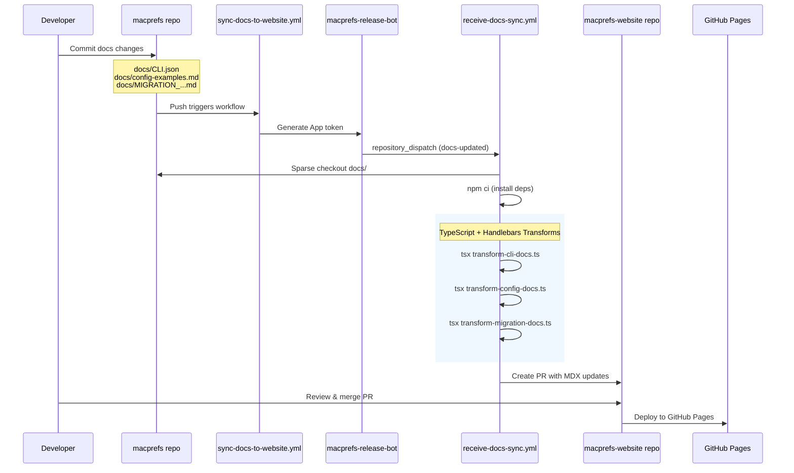

# Documentation Transformation Pipeline

This document describes the TypeScript + Handlebars-based documentation transformation pipeline that syncs content from the macprefs repository to the macprefs-website.

## Overview

The documentation sync system automatically transforms canonical documentation from the macprefs CLI repository into MDX pages for the Astro/Starlight website. The pipeline uses TypeScript for type safety and Handlebars.js for templating.

## Architecture



## Transformation Scripts

| Script | Input | Output | Description |
|--------|-------|--------|-------------|
| `transform-cli-docs.ts` | `docs/CLI.json` | `reference/cli.mdx` | CLI command reference |
| `transform-config-docs.ts` | `docs/config-examples.md` | `reference/configuration.mdx` | Configuration examples |
| `transform-migration-docs.ts` | `docs/MIGRATION_...md` | 6 MDX files | Multi-page migration guide |

### Migration Guide Fan-Out

The migration guide transformation fans out to 6 target pages:

| Source Section | Target File | Strategy |
|----------------|-------------|----------|
| Quick Start | `getting-started/quick-start.mdx` | Replace |
| Manual Curation Workflow | `guides/migration-curation.mdx` | Create |
| Recommended Template | `getting-started/first-config.mdx` | Replace |
| Common Pitfalls | `guides/migration-pitfalls.mdx` | Create |
| Dotfiles Integration | `guides/power-users.mdx` | Merge section |
| Troubleshooting | `reference/troubleshooting.mdx` | Create |

## Directory Structure

```
scripts/
├── transform-cli-docs.ts       # CLI docs transformer
├── transform-config-docs.ts    # Config docs transformer
├── transform-migration-docs.ts # Migration guide transformer
├── cli-enrichments.json        # Additional CLI metadata
├── helpers/
│   └── cli-helpers.ts          # Shared Handlebars helpers
├── templates/
│   ├── cli-reference.hbs       # CLI page template
│   ├── configuration.hbs       # Config page template
│   └── partials/
│       ├── frontmatter.hbs     # YAML frontmatter partial
│       ├── command.hbs         # Command section partial
│       ├── flags-table.hbs     # Flags table partial
│       └── tier-comparison.hbs # Tier comparison partial
├── types/
│   └── cli-types.ts            # TypeScript type definitions
└── legacy/                     # Backup of original CJS scripts
    ├── README.md
    ├── transform-cli-docs.cjs
    └── transform-config-docs.cjs
```

## Running Transforms Locally

```bash
# Install dependencies
npm ci

# CLI docs
npx tsx scripts/transform-cli-docs.ts path/to/CLI.json src/content/docs/reference/cli.mdx

# Config docs
npx tsx scripts/transform-config-docs.ts path/to/config-examples.md src/content/docs/reference/configuration.mdx

# Migration guide (writes to 6 files automatically)
npx tsx scripts/transform-migration-docs.ts path/to/MIGRATION_SETUP_CONFIG_AND_TROUBLESHOOTING.md
```

Or use the npm scripts:

```bash
npm run transform:cli
npm run transform:config
npm run transform:migration
```

## Rollback Procedures

### Disable Individual Transforms

In `.github/workflows/receive-docs-sync.yml`, comment out the relevant transform block:

```yaml
# To disable CLI transform:
# npx tsx scripts/transform-cli-docs.ts ...

# To disable config transform:
# if [ -f macprefs-source/docs/config-examples.md ]; then
#   npx tsx scripts/transform-config-docs.ts ...
# fi

# To disable migration transform:
# if [ -f macprefs-source/docs/MIGRATION_...md ]; then
#   npx tsx scripts/transform-migration-docs.ts ...
# fi
```

### Revert to Legacy CJS Scripts

Legacy CommonJS scripts are preserved in `scripts/legacy/`. To revert:

1. Replace TypeScript invocation with CJS:
   ```yaml
   # Instead of:
   npx tsx scripts/transform-cli-docs.ts ...
   
   # Use:
   node scripts/legacy/transform-cli-docs.cjs ...
   ```

2. Note: Legacy scripts require `cli-enrichments.json` in the same directory.

### Revert Bad Deploy

1. Identify the last good commit on `main`
2. Create a revert PR or cherry-pick the good state
3. Merge to trigger new deployment

## Key Design Decisions

1. **TypeScript + tsx**: Provides type safety and runs directly without compilation step
2. **Handlebars.js**: Separates presentation (templates) from logic (TypeScript)
3. **Idempotent transforms**: Running multiple times produces identical output
4. **Merge-section strategy**: Preserves non-migration content in power-users.mdx
5. **Preserved frontmatter**: Existing page metadata is kept during updates

## Validation

Before merging transform changes:

1. Run `npm run check` - TypeScript and Astro validation
2. Run `npm run build` - Full site build
3. Verify transforms are idempotent (run twice, compare output)
4. Visual inspection in `npm run dev`

